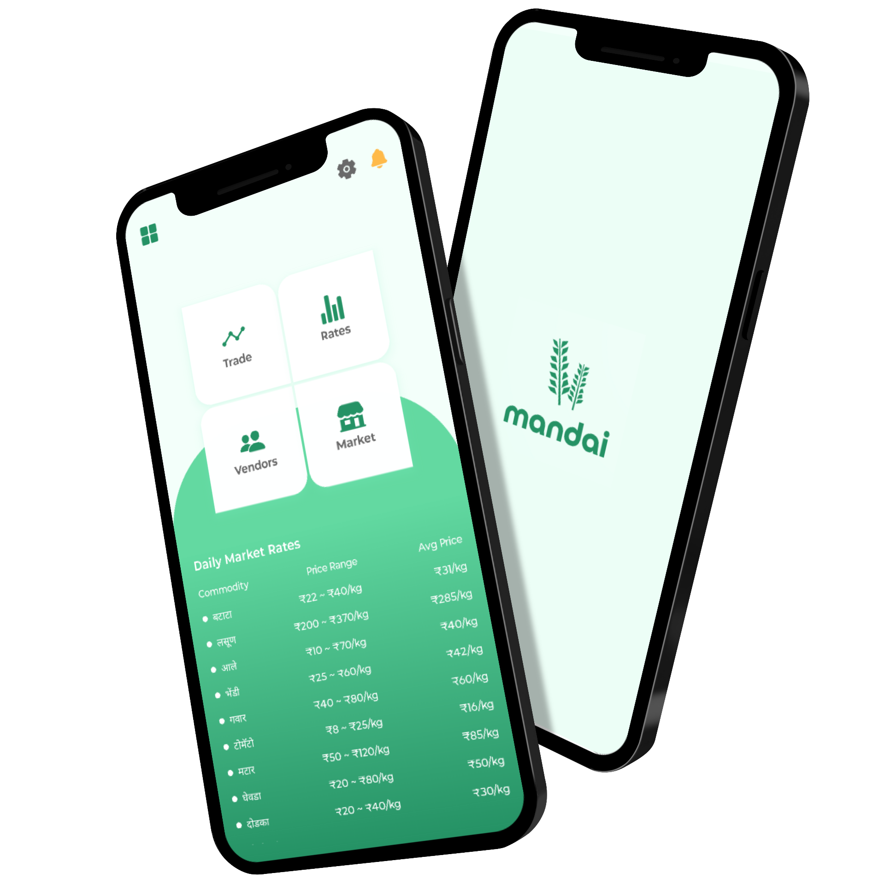
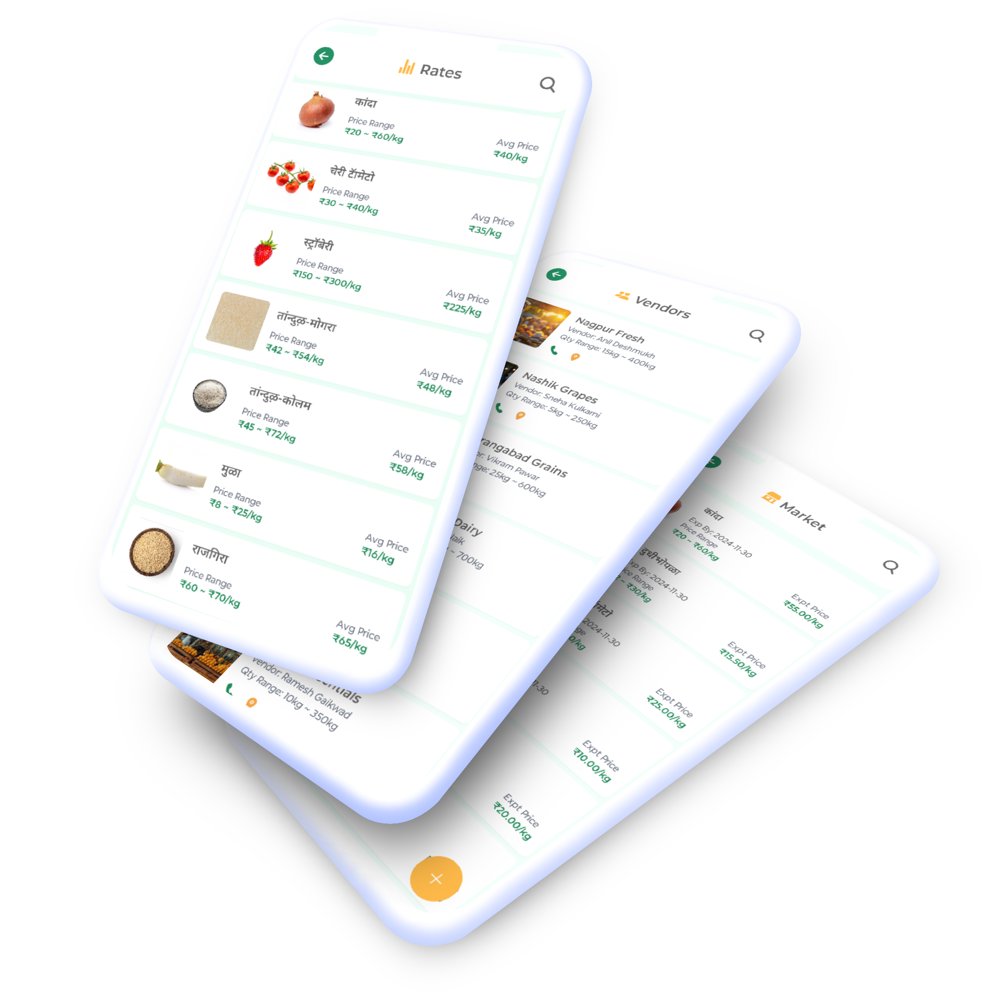

# Mandai Backend API

This repository contains the backend API for Mandai, a mobile app connecting farmers, vendors, and restaurants for seamless commodity trading. Built on Django, this backend powers real-time market updates, direct trade operations, and order management, integrating with a React Native frontend.

### Overview

Mandai is a mobile app designed to empower farmers, vendors, and restaurants by enabling seamless trade of bulk commodities. It provides real-time market price updates, ensuring fair deals and eliminating exploitation by middlemen. Farmers can directly sell their produce to restaurants or vendors, maximizing profits, while restaurants benefit from transparent pricing and streamlined order management.

### Motivation

The lack of transparency in agricultural trading leads to unfair pricing and reduced profits for farmers. Mandai empowers farmers, ensures fair market deals, and simplifies supply chain management for all stakeholders, fostering trust and efficiency.



### Features
   - **Live Price Updates:** Stay informed about current market rates with automated scraping.
   - **Direct Marketplace:** Farmers can post and sell directly to restaurants or vendors.
   - **Order & Payment Management:** Simplifies bulk trading for restaurants with secure APIs.
   - **Notifications:** Alerts for price changes, orders, and listings via integrated services.

### Tech Stack

- **[Django](https://www.djangoproject.com/)** - Web framework for backend logic, APIs, and data management.
- **[Celery](https://docs.celeryproject.org)** - Scheduled scraping tasks and asynchronous processing.
- **[Redis](https://redis.io)** - Task queue management and caching for real-time updates.
- **[Selenium](https://www.selenium.dev/)** - Automated web scraping of commodity prices from trusted sources.
- **[PostgreSQL (Neon DB)](https://neon.tech/)** - Reliable database for user data, listings, and orders.
- **[AWS S3](https://aws.amazon.com/s3/)** - Secure storage for commodity images and files.
- **[Docker](https://www.docker.com/)** - Containerized deployment with GitHub Actions for CI/CD.
- **[Python 3.8+](https://www.python.org/)** - Core programming language.
- **React Native Frontend** - See [Mandai Frontend repo](https://github.com/yogesh-bhandare/mandai) for the client-side codebase.

## Setup & Installation

### Prerequisites
- **[Python 3.8+](https://www.python.org/downloads/)** - Ensure Python is installed.
- **[Redis Instance](https://redis.io/download)** - For task queuing and caching.
- **[Git](https://git-scm.com/)** - Version control system.
- **[Docker](https://www.docker.com/get-started)** - For containerized services (optional).

1. **Clone the Repository**
   ```bash
   git clone https://github.com/yogesh-bhandare/mandai-backend-api.git
   cd mandai-backend-api
   ```

2. **Install Dependencies**
   ```bash
   pip install --upgrade pip
   pip install -r requirements.txt
   ```

3. **Redis Setup (Using Docker)**
   Start Redis on redis://localhost:6170:
   ```bash
   docker compose -f compose.yaml up -d
   ```

4. **Environment Configuration**
   Create a .env file in the project root:
   ```bash
   CELERY_BROKER_REDIS_URL="redis://localhost:6170"
   DEBUG=True
   DATABASE_URL=<your-postgres-url>
   ```

5. **Database Setup**
   ```bash
   python manage.py migrate
   ```

6. **Start Services**
   In separate terminals:
   ```bash
   # Terminal 1: Django Server
   python manage.py runserver
   ```
   ```bash
   # Terminal 2: Celery Worker & Beat
   celery -A mandai worker --beat
   ```

### Running App
Download and use the Mandai app to explore its features: [Download Mandai App](https://mandai-app.s3.us-east-1.amazonaws.com/download/Mandai.apk)



### License
This project is licensed under the MIT License. See the [LICENSE](LICENSE) file for details.

For the frontend codebase, visit [Mandai Frontend](https://github.com/yogesh-bhandare/mandai).